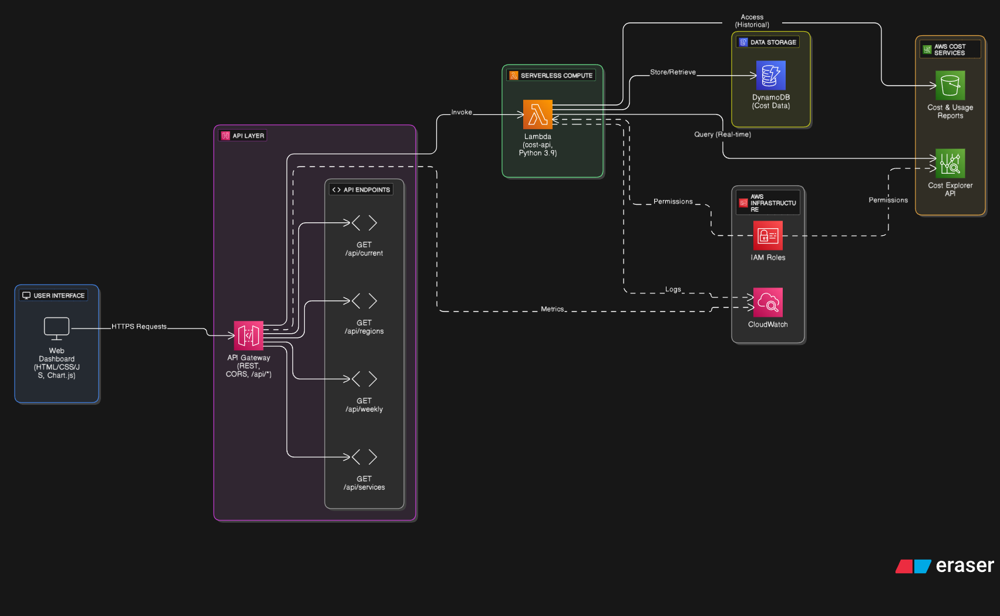
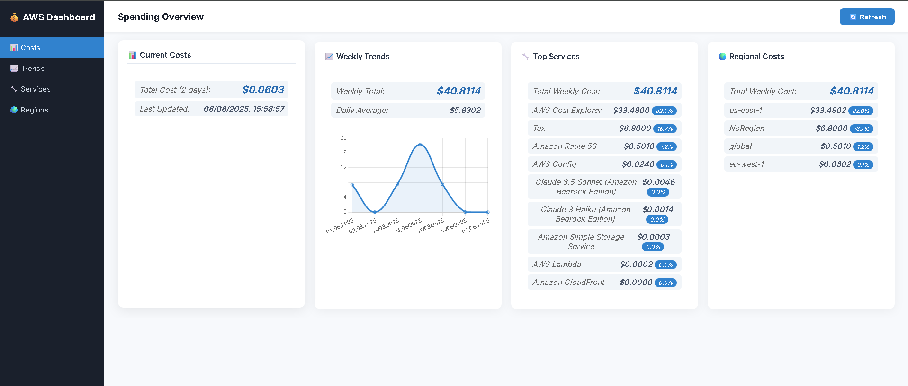
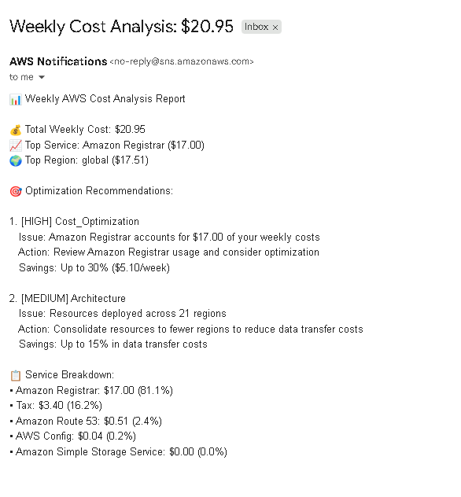

# AWS Cost Optimization Dashboard

A real-time web dashboard for monitoring and analyzing AWS spending patterns, built for small businesses and individual developers who need cost visibility without enterprise-level complexity.

## Architecture Diagram



## 📖 Spending Overview



## Cost Analysis



## 🎯 Business Problem Solved

Many small businesses and developers struggle with AWS cost visibility:

- Monthly bills arrive with little context about spending patterns
- No real-time visibility into cost accumulation
- Difficulty identifying optimization opportunities
- Enterprise cost management tools are too expensive ($2000+/month)

This dashboard provides **immediate cost insights** to help make informed decisions about AWS resource usage.

## 🏗️ Architecture

### Backend Components

- **AWS Lambda Functions**: Serverless compute for cost data processing
- **API Gateway**: RESTful API endpoints for dashboard integration
- **AWS Cost Explorer API**: Real-time cost data retrieval
- **DynamoDB**: Cost data storage and historical analysis

### Frontend

- **Responsive Web Dashboard**: Modern HTML/CSS/JavaScript interface
- **Chart.js Integration**: Interactive cost trend visualizations
- **Real-time Data Updates**: Live AWS cost information

## 📊 Key Features

### Cost Monitoring

- **Real-time cost tracking** with 2-day rolling window
- **Weekly trend analysis** with daily breakdowns
- **Service-level cost breakdown** showing top spending categories
- **Regional cost distribution** across AWS regions

### Business Intelligence

- **Percentage-based analysis** for quick identification of cost drivers
- **Historical trending** to identify spending patterns
- **Interactive charts** for visual cost analysis
- **Responsive design** for mobile and desktop access

## 🚀 Technical Implementation

### API Endpoints

```http
GET /api/current     - Current cost metrics (2-day window)
GET /api/weekly      - Weekly cost trends and daily breakdown
GET /api/services    - Top 10 AWS services by cost with percentages
GET /api/regions     - Regional cost distribution analysis
```

### Key Technical Decisions

- **Serverless Architecture**: Chose Lambda + API Gateway for cost efficiency and automatic scaling
- **Cost Explorer API**: Direct integration with AWS billing data for accuracy
- **Client-side Rendering**: Simple HTML/JS for fast development and easy customization
- **Chart.js**: Lightweight charting library for responsive visualizations

## 💰 Business Value Delivered

### Cost Optimization

- **Immediate visibility** into spending patterns
- **Service-level insights** to identify optimization opportunities
- **Regional analysis** to optimize resource placement
- **Trend analysis** for budget planning and forecasting

### Decision Support

- **Data-driven resource decisions** based on actual usage patterns
- **Quick identification** of cost anomalies or spikes
- **Historical context** for understanding spending trends
- **Stakeholder reporting** with professional visualizations

## 🛠️ Deployment Guide

### Prerequisites

- AWS Account with appropriate permissions
- AWS CLI configured
- Cost Explorer API access enabled

### Setup Instructions

1. **Deploy Lambda Functions**

   ```bash
   # Deploy cost tracking functions
   aws lambda create-function --function-name cost-api \
     --runtime python3.9 --handler lambda_function.lambda_handler \
     --zip-file fileb://cost-api.zip
   ```

2. **Configure API Gateway**

   ```bash
   # Create REST API
   aws apigateway create-rest-api --name cost-dashboard-api \
     --description "API for AWS Cost Dashboard"
   ```

3. **Set Environment Variables**

   ```bash
   # Configure API endpoint in dashboard
   const API_URL = 'https://your-api-id.execute-api.region.amazonaws.com/prod';
   ```

4. **Open Dashboard**
   - Open `dashboard.html` in web browser
   - Dashboard automatically loads real-time cost data

## 📈 Usage Examples

### Small Business Use Case

*"A consulting firm spending $1,500/month on AWS can quickly identify that 85% of costs come from Route 53 and optimize DNS configuration, saving $200/month."*

### Developer Use Case

> An individual developer can track daily spending patterns and receive immediate feedback on resource usage, preventing bill shock.

## 🔧 Customization Options

### Time Ranges

- Modify date ranges in Lambda functions for different analysis periods
- Adjust granularity (daily/weekly/monthly) based on needs

### Visualization

- Customize chart colors and styles in dashboard.html
- Add new chart types for different cost perspectives
- Modify responsive breakpoints for different screen sizes

## ⚡ Performance Considerations

- **Lambda cold starts**: ~2-3 second initial load time
- **API Gateway limits**: 10,000 requests per second default
- **Cost Explorer API**: Rate limited to prevent excessive billing charges
- **Browser caching**: Dashboard caches data for 5 minutes to reduce API calls

## 🔒 Security Notes

- **CORS enabled** for cross-origin dashboard access
- **No authentication** in current version (suitable for personal use)
- **IAM permissions** required for Cost Explorer API access
- **Consider VPC deployment** for production enterprise use

## 💡 Future Enhancement Opportunities

### Technical Improvements

- User authentication and multi-account support
- Data persistence with historical trend storage
- Automated cost anomaly detection and alerting
- Mobile app development for on-the-go monitoring

### Business Features

- Budget setting and violation alerts
- Cost optimization recommendations engine
- Automated reporting and email notifications
- Integration with other AWS services (CloudWatch, SNS)

## 📝 Lessons Learned

### Technical Insights

- **Serverless architecture** significantly reduces operational overhead
- **Direct API integration** provides more accurate data than bill parsing
- **Client-side rendering** allows for rapid prototyping and iteration

### Business Understanding

- **Cost visibility drives behavior change** - users immediately start optimizing
- **Simple dashboards often more valuable** than complex enterprise tools
- **Real-time data crucial** for preventing cost overruns

## 🎓 Skills Demonstrated

- **Cloud Architecture**: AWS Lambda, API Gateway, serverless design
- **API Development**: RESTful services, error handling, CORS configuration
- **Frontend Development**: Responsive design, JavaScript, data visualization
- **Business Analysis**: Cost optimization, stakeholder communication
- **Problem Solving**: Real-world business problem identification and solution

## 📊 Project Metrics

- **Development Time**: 6 weeks (part-time)
- **AWS Services Used**: 4 (Lambda, API Gateway, Cost Explorer, DynamoDB)
- **Lines of Code**: ~500 (Python + JavaScript + HTML/CSS)
- **API Response Time**: <2 seconds average
- **Cost to Run**: <$10/month for typical small business usage

---

*This project demonstrates the intersection of technical implementation and business value creation, showing how cloud technologies can solve real-world cost management challenges for small businesses and individual developers.*
